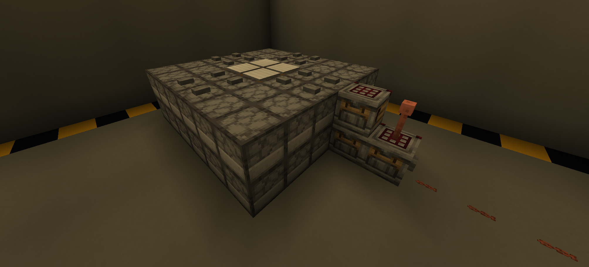

# Подача заявки на сервер

{ width="300" }


Добро пожаловать! Чтобы присоединиться к игре на **Magatamy-V2**, вам необходимо пройти небольшой процесс верификации и подать заявку. Это помогает нам поддерживать адекватное комьюнити и комфортную игру.

!!! info "Перед подачей заявки"
    Убедитесь, что вы полностью ознакомились с правилами сервера. Игра на сервере подразумевает ваше автоматическое согласие с ними.

## Как подать заявку

Процесс подачи заявки проходит через наш Discord.

1. Перейдите в наш Discord-сервер.
2. Найдите канал форума, предназначенный для заявок (например, `#заявки` или `#whitelist`).
3. Создайте новую тему (пост) и заполните анкету строго по шаблону ниже.

## Шаблон заявки

Скопируйте этот текст, вставьте в свой пост и заполните данные:

```text
1. Игровой никнейм (ник в Minecraft):
2. Ваш возраст:
3. Как давно вы играете в Minecraft?
4. Чем больше всего любите заниматься в игре? (Строительство, редстоун-механизмы, проектирование ферм, изучение кастомных механик и т.д.)
5. Откуда узнали о нашем сервере?
6. Пара слов о себе (ваши планы на сезон, хобби и т.д.):
```

??? tip "Совет для хорошей заявки"
    Постарайтесь расписать 4-й и 6-й пункты подробнее. Нам интересно узнать, какие проекты (кастомные механизмы, автоматизацию или архитектуру) вы планируете реализовывать, так как мы уделяем большое внимание интересным механикам и плагинам.

## Что происходит после подачи?

После публикации вашей заявки администрация рассмотрит её. 
Если заявка будет одобрена, вы получите соответствующую роль в Discord, а ваш ник будет добавлен в `whitelist`.

!!! warning "Важно"
    Пожалуйста, имейте терпение и не пишите администрации в личные сообщения с просьбами "быстрее проверить заявку". Это может повлиять на решение не в вашу пользу.